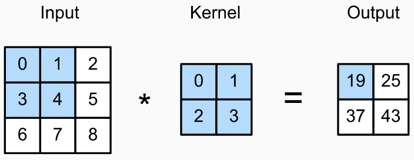

# 1. Introduction

Deep learning has become a central tool in the medical field, playing a crucial role in the early detection of various diseases to prevent life-threatening cases. In this context, we present a model specifically designed to detect signs of pneumonia using X-ray images of both healthy and unhealthy lungs. Our approach involves the implementation of custom neural network layers and a custom data generator that allows the extraction of trainable images directly from text files. Through this project, we aim to demonstrate the effectiveness of deep learning in medical diagnostics, focusing on pneumonia detection as a case study.       

# 2. Implementation

## 2.1 Datagenerator

``` python
     resolution = 224
        transform = transforms.Compose([
            transforms.Resize((resolution, resolution)),
            transforms.ToTensor(),
            transforms.Normalize((0.5, 0.5, 0.5), (0.5, 0.5, 0.5))
        ])
        first_set= ImageFolder(root='./data/training', transform=transform)
        training_set, eval_set = torch.utils.data.random_split(first_set, [2412, 270])

        def custom_collate_fn(batch):
            images, labels = zip(*batch)
            return torch.stack(images), torch.tensor(labels)

        training_loader = DataLoader(training_set, batch_size=20, shuffle=True, collate_fn=custom_collate_fn)
        eval_loader=DataLoader(eval_set,batch_size=1, shuffle=True, collate_fn=custom_collate_fn)
        testing_set = CustomDataset("./data/test", transform=transform)
        testing_loader = DataLoader(testing_set, batch_size=1, shuffle=False)

        model = create_model(resolution, load_previous_model=False)
        train(model, training_loader,eval_loader, epochs=20, save=True)

        model_test(model,testing_loader)
```

The training set of our model consists mainly of .jpeg images, and to seamlessly integrate these images into our model, we chose the convenience of the PIL library. Though the image data is random split into training and valuation data before we begin training

In contrast, the test set uses a unique format - a collection of .txt files. Each file encapsulates a 224x224 matrix representing a monochromatic image. Recognizing this unconventional data format, we developed a custom data generator explicitly tailored to our use case.

When retrieving an image from the data frame, our approach involves reading the file based on its path. We then convert it into a 3-color channel representation (since the model is trained on 3-color images) and apply augmentations. Notably, the augmentations applied to the images in our test set mirror those applied to the images in our training set.

``` python
    class CustomDataset(Dataset):
        def __init__(self, path, transform=None):
            self.data_frame = None
            self.get_data_frame(path)
            self.transform = transform

        def __len__(self):
            return len(self.data_frame)

        def __getitem__(self, idx):
            img_path, label = self.data_frame.iloc[idx]
            image = self.__get_image(img_path)
            return image, label

        def __get_image(self, file_path, target_size=(224, 224)):
            pil_image = Image.fromarray(np.uint8(pd.read_fwf(file_path).to_numpy())).convert('RGB')
            transform = transforms.Compose([
                transforms.Resize(target_size),
                transforms.ToTensor(),
            ])
            image = transform(pil_image)

            return image

        def get_data_frame(self, path):
            if path.endswith('.txt'):
                df = pd.read_csv(path, sep=' ', header=None, names=['filenames', 'labels'])
            else:
                df = pd.DataFrame()
                filenames = []
                labels = []
                image_class = 0

                for directory in os.listdir(path):
                    if not directory.startswith("."):
                        images = os.listdir(os.path.join(path, directory))

                        for image in images:
                            filenames.append(os.path.join(path,directory, image))
                            labels.append(image_class)

                        image_class = 1
                df["filenames"] = filenames
                df["labels"] = labels

            self.data_frame = df
```

## 2.2 Linear layer

The PyTorch linear layer applies a linear transformation to the input, which can be described as below 

<br>
<p align="center">
     
</p>
<p align="center">
     Equation (1)
</p>
<br>
Here X is the input, A is the weight matrix and B is the bias. Dimensions for each matrix/vector is specified below the terms in the equation. in and out is the in- and output dimensions, and d is some arbitrary number of rows. The PyTorch linear layer needs 'in_feature' (int), 'out_features' (int), and bias (bool). We will follow this construction for our own linear layer.          

In line 2, we initialize the linear layer, and specify names for the inputs. Then lines 4,5 and 6 define the instance attributes from the inputs. Then line 7 and 9 defines the learnable parameters weights and bias. Both of the parameters are initialized with the torch method randn, which returns a tensor consisting of random numbers from a standard normal distribution. The dimensions of the tensor for the weights is '(outFeatures, inFeatures)', and for the bias '(outFeatures)'. For both parameters, the tensors are wrapped in torch.nn.Parameter, to let the network know that these are trainable features. Further, if bias is not true, the parameter is set to 'None' in line 11.

In the forward method, the mathematical operations described in equation(1) are defined in line 14. Further, lines 11 and 12 are added to check if the dimensions of the input and the weight matrix match, since this is required for the operations in line 14.

In the mathematical operations we have that $X\times A^T$ gives an output of size d X out, then before the bias can be added the concept of broadcasting is being utilized so expand the bias vector to the correct dimensions d X out.
<br>

``` python
class Linearlayer(nn.Module):
    def __init__(self, inFeatures, outFeatures, bias = True):
        super().__init__()
        self.inFeatures = inFeatures
        self.outFeatures = outFeatures
        self.bias = bias
        self.weights = torch.nn.Parameter(torch.randn( outFeatures, inFeatures))
        if bias:
            self.bias = torch.nn.Parameter(torch.rand(outFeatures))
        else:
            self.register_parameter('bias',None)

    def forward(self, input):
        r , c = input.shape
        if c != self.inFeatures:
            sys.exit(f'Dimensions do not match. Input must have {self.inFeatures} columns.')
        output = input @ self.weights.t() + self.bias
        return output
```
      
## 2.3 Convolutional layer

Similarly to the implementation of the linear layer, the convolutional layer starts with defining instance attributes in lines 4 to 8. The parameters are initialized to tensors in the required dimensions and are wrapped in torch.nn.Parameter method to make these learnable parameters.The first 4 lines (lines 11-14) in the forward function get/compute needed variables for executing the convolution. Line 15 initializes the output to be a tensor of zeroes.

Lines 17 to 23 perform convolution on the input. The figure below illustrates a simple example of correlation. Correlation where the kernel is flipped is equal to convolution. In a neural network, it is unimportant if the layer is using correlation or convolution. The network will learn the appropriate values of the kernel nevertheless.

In the example, the output of 19 is computed by multiplying the matrices elementwise and then taking the sum. Then the shaded area in the input matrix is moves one to the right and the computation is repeated for the new values to get 25. This same computation is replicated in lines 21-22 in the code, where for every i and j in the dimensions of the output matrix we compute the elementwise multiplication between the kernel and a submatrix of the input. The notation 'i:i+kernelHeight' gives the values from i to i+kernelHeight -1, that is the last value is not included and the submatrix of the input is of the same dimensions as the kernel. Finally, in line 23 a bias is added.

<br>
<p align="center">
     
</p>
<p align="center">
     Figure 1 : Simple example of correlation between input and kernel.
</p>
<br>

``` python
class convLayer(nn.Module):
    def __init__(self, inFeatures, outFeatures, kernelSize, bias=True):
        super().__init__()
        self.kernels = nn.Parameter(torch.randn(outFeatures, inFeatures, kernelSize, kernelSize))
        if bias:
            self.bias = torch.nn.Parameter(torch.rand(outFeatures))
        else:
            self.register_parameter('bias', None)

    def forward(self, input):
        batchSize, _, inputHeight, inputWidth = input.shape
        outFeatures, _, kernelHeight, kernelWidth = self.kernels.shape
        outputHeight = inputHeight - kernelHeight + 1
        outputWidth = inputWidth - kernelWidth + 1
        output = torch.zeros((batchSize, outFeatures, outputHeight, outputWidth), dtype=input.dtype).to(input.device)

        for k in range(outFeatures):
            for i in range(outputHeight):
                for j in range(outputWidth):
                    # Convolution operation
                    output[:, k, i, j] = torch.sum(
                        input[:, :, i:i + kernelHeight, j:j + kernelWidth] * self.kernels[k])

            # Add bias if exists
            if hasattr(self, 'bias') and self.bias is not None:
                output[:, k, :, :] += self.bias[k]

        return output
```

## 2.4 Model architecture

We used a sequential model with 13 layers for the network architecture. Figure 2 shows the structure visually. The model uses the binary cross entropy function to classify binary data. Convolutional layers (conv2)(first using the custom layer but it took so long that it timed out colab so switched to inbuilt convolution layer) extract features, ReLU activation introduces nonlinearity, pooling layers downsample spatial dimensions, and dropout layers prevent overfitting. The adaptive average pooling layer prepares the data for fully connected layers, which act as classifiers for the final binary prediction.      

``` python
class CustomModel(nn.Module):
    def __init__(self, resolution):
        super(CustomModel, self).__init__()
        self.conv1 = convLayer(3, 16, kernelSize=3)
        self.activation1 = nn.ReLU()
        self.pool1 = nn.MaxPool2d(2)
        self.dropout1 = nn.Dropout(0.2)
        self.conv2 = convLayer(16, 16, kernelSize=3)
        self.activation2 = nn.ReLU()
        self.pool2 = nn.MaxPool2d(2)
        self.dropout2 = nn.Dropout(0.2)
        self.conv3 = convLayer(16, 64, kernelSize=3)
        self.activation3 = nn.ReLU()
        self.pool3 = nn.MaxPool2d(2)
        self.dropout3 = nn.Dropout(0.2)
        self.avgpool = nn.AdaptiveAvgPool2d((1, 1))
        self.fc = linLayer(64, 512)
        self.activation4 = nn.ReLU()
        self.dropout4 = nn.Dropout(0.5)
        self.fc2 = linLayer(512, 1)

    def forward(self, x):
        x = self.conv1(x)
        x = self.activation1(x)
        x = self.pool1(x)
        x = self.dropout1(x)
        x = self.conv2(x)
        x = self.activation2(x)
        x = self.pool2(x)
        x = self.dropout2(x)
        x = self.conv3(x)
        x = self.activation3(x)
        x = self.pool3(x)
        x = self.dropout3(x)
        x = self.avgpool(x)
        x = x.view(x.size(0), -1)
        x = self.fc(x)
        x = self.activation4(x)
        x = self.dropout4(x)
        x = self.fc2(x)
        return x

def create_model(resolution, load_previous_model=True):
    if os.path.isfile(MODEL_NAME) and load_previous_model:
        return torch.load(MODEL_NAME)
    else:
        model = CustomModel(resolution)
        return model
```
<br>
<p align="center">
 
</p>
<p align="center">
     Figure 2 : Our Model Architecture.
</p>
<br>

# 3. Visualizing the results
<br>
<p align="center">

</p>
<p align="center">
     Figure 3 : eval accuracy as a graph with the final test accuracy as a line.
</p>
<br>
The accuracy for the evaluation set is really good as can be seen on the graph above. The test accuracy however is less good. This suggest some difference between the training and evaluation sets and test possible origins for these difference are discussed in the conclusion. 

# 4. Conclusion

Our model classified the validation set with high accuracy getting around 90 percent when fully trained. However, our model did poorer on the test set where it only scored around 60 percent. This difference in results can be a consequence of a few different sources. The first could be the transformation from txt file to rbg pil image. This made the members of the test data set slightly different enough from the other two datasets, so that they were harder to classify. The second source could be the small size of the test data set which means that there is a greater probability for big variance in the test members won't be absorbed by the size of the data set. The composition of the data sets could also play a minor role since the training and the evaluation sets were even split on healthy and unhealthy lungs, where the test set had around a 60 40 spilt. The convolution layer we designed was incredibly much slower than the actual convolution layer since our implementation was relatively simple.
